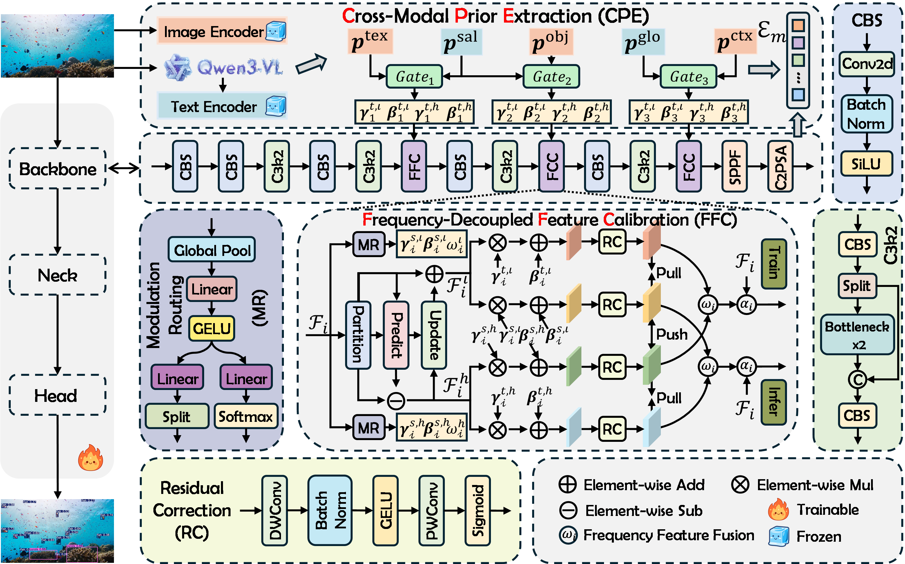

# GeoCR

This is an official PyTorch implementation of paper **GeoCR: Geometric Calibration and Rebalancing for Long-Tailed Underwater Object
Detection**.


<p align="center">
  
</p>


## Installation

The reference environment uses Python 3.10.20, PyTorch 2.7.0 with CUDA 12.8, torchvision 0.22.0, and NumPy 1.26.4.
Choose a PyTorch build compatible with your own CUDA driver.

```bash
conda create -n Geocr python=3.10 -y
conda activate Geocr

pip install torch==2.7.0 torchvision==0.22.0 --index-url https://download.pytorch.org/whl/cu128
pip install -r requirements.txt
pip install -e .
```

For CPU-only or other CUDA environments, follow the
[official PyTorch installation selector](https://pytorch.org/get-started/locally/).

## CPE priors
| Datasets                | Download |
|-------------------------| --- |
| `RUOD`                  | [Download](https://example.invalid/geocr-priors/RUOD/prompt_index.jsonl) |
| `DUO`                   | [Download](https://example.invalid/geocr-priors/RUOD/emb_p3.npy) |
| `URPC2019`              | [Download](https://example.invalid/geocr-priors/RUOD/emb_p4.npy) |

```text
GeoCR/
└── priors/
    └── RUOD/
        ├── prompt_index.jsonl
        ├── emb_p3.npy
        ├── emb_p4.npy
        ├── emb_p5.npy
        ├── v_diff_embeddings.npy
        └── global_embeddings.npy
```

Dataset definitions live in [`yaml`](yaml). Adjust their `path` and `geocr.cpe` values if your data is stored
elsewhere.


## Training

```bash
python train.py \
  --data yaml/RUOD.yaml \
  --model ultralytics/cfg/geocr/geocr.yaml \
  --weights yolo11s.pt \
  --epochs 300 \
  --batch 16 \
  --device 0
```


## License and acknowledgements

This project builds on [Ultralytics](https://github.com/ultralytics/ultralytics). We thank their authors and the maintainers of the underwater
detection datasets used in the research.
